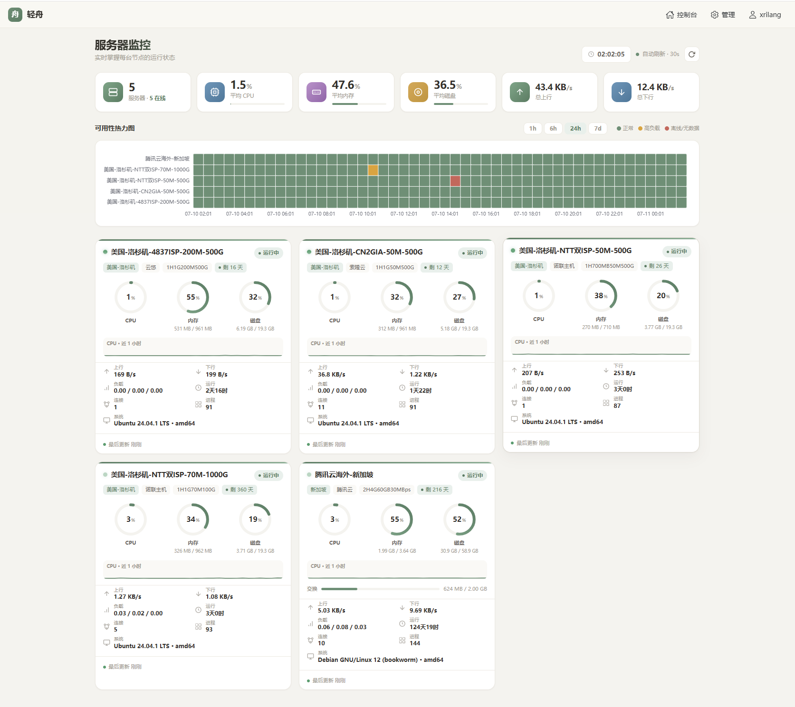
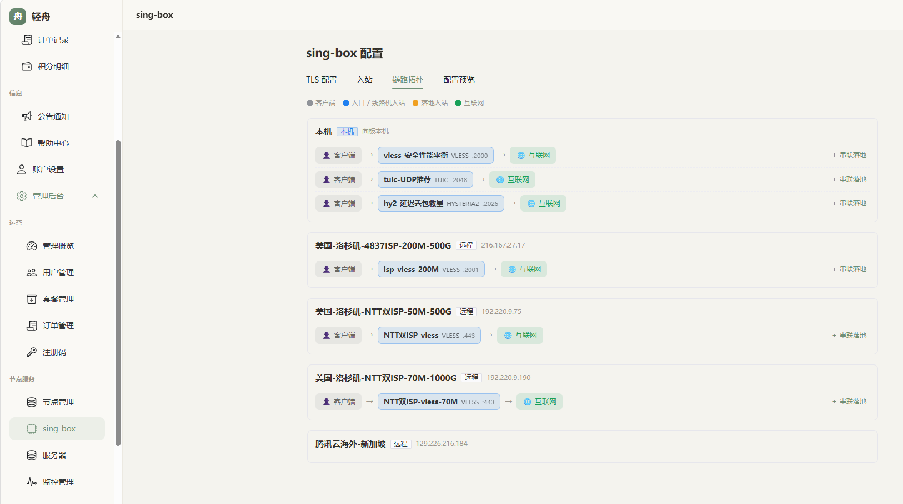
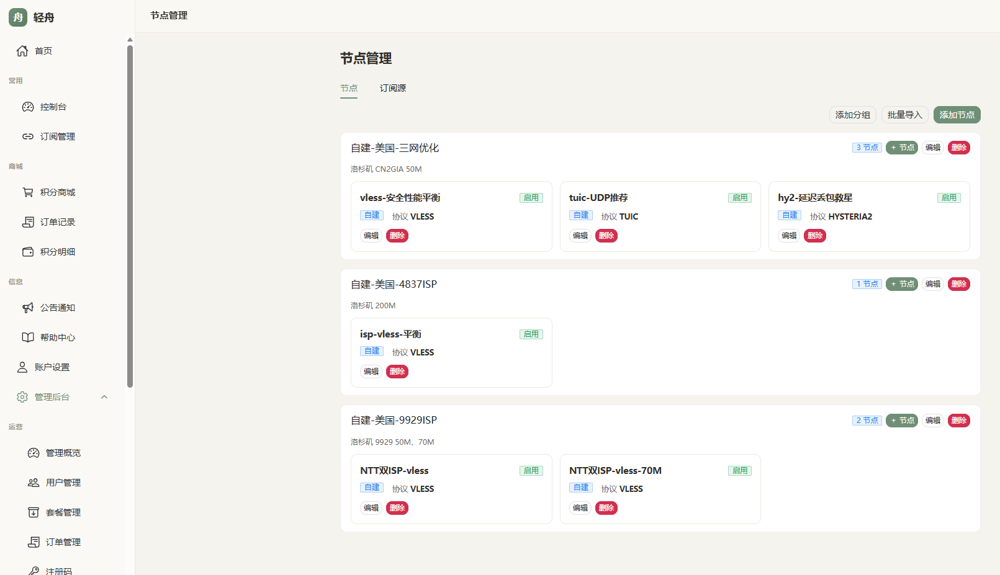
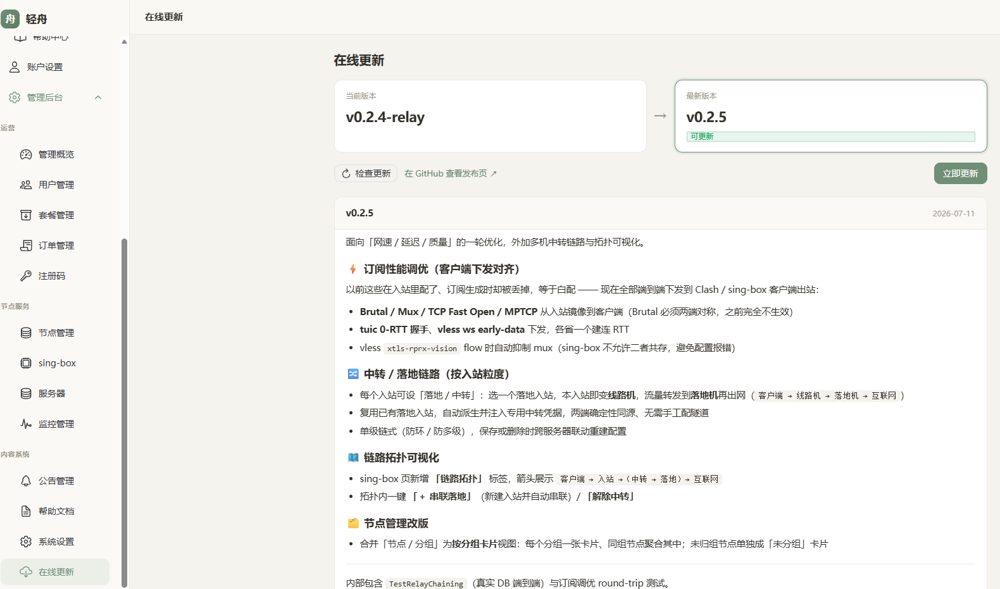

# 轻舟 (QingZhou)

> 面向终端用户的**轻量级多用户代理订阅管理面板** —— 单文件部署，自管原生 sing-box，把「人 / 钱 / 节点 / 订阅 / 统计」一站式管起来。


轻舟是一个**开箱即用的代理业务前台**：管理员在可视化后台管理节点、套餐和用户，普通用户注册后用积分自助购买流量包 / 订阅套餐，拿到一条**多端自适应**的订阅链接。真正承载流量的是 **sing-box**（作为独立进程运行），轻舟负责生成并下发它的配置、采集每用户流量、并把整套业务（注册登录、计费、订阅、统计、运营）包好。

**它适合谁**：想给一小群人（家庭 / 朋友 / 小团队）自建、自管代理订阅服务，又不想被臃肿面板和一堆依赖折腾的人。**一台 1H1G 的小机器**就能把面板和落地节点一起跑起来。

---

## ✨ 核心优势

- **🪶 单文件部署** —— 一个 Go 二进制内嵌了 Vue 前端和 SQLite 驱动，无需 Node 构建、无需 CGO、无需外部数据库。丢到服务器上配个 systemd 就能跑。
- **🔌 不依赖任何外部面板** —— 轻舟**自管原生 sing-box**：面板直接生成 `config.json`、下发、reload，并通过 sing-box 官方 `v2ray_api` 读回每用户流量。不套壳、不二次代理别的面板。
- **🎛️ 8 协议纯可视化** —— 下拉、开关、零手写 JSON 即可管理 TLS / Reality 和入站，覆盖 **vless / vmess / trojan / tuic / hysteria2 / shadowsocks / anytls / hysteria**，含传输层（ws/grpc/httpupgrade）与 uTLS / ALPN / Mux / Brutal。
- **📱 订阅多端自适应** —— 同一条链接按客户端 `User-Agent` 自动返回 **Clash / sing-box / Surge**，其余回退 base64；内置 **URLTest 智能优选**（全局选最快 / 锁定 IP 只切协议）与**防泄漏分流模板**（国内直连 / 广告拦截 / 其余代理），开箱即用。
- **⚡ 面向网速/延迟的调优下发** —— **Brutal / Mux / TCP Fast Open / MPTCP、tuic 0-RTT、ws early-data** 从入站自动镜像到客户端出站——这些两端对称才生效的项，以前配了却在订阅里丢掉，现在端到端对齐（vless vision flow 时自动避让 mux）。
- **🔀 中转 / 落地链路** —— 入站可设「落地 / 中转」：选一个落地入站，本入站即变**线路机**，流量转发到**落地机**再出网（`客户端 → 线路机 → 落地机 → 互联网`）；复用已有落地入站、自动派生并注入中转凭据，无需手工配隧道，**链路拓扑图**可视化。
- **🧾 多套餐独立计费（桶模型）** —— 一个用户可同时持有多个套餐，每个套餐是独立的「桶」（各自流量 / 到期 / 节点 / 计量身份）；某套餐到期只下线它名下的节点，互不影响。重复购买同套餐自动**续费叠加**，退款按**剩余流量/时间比例**结算（详见[计费与退款业务说明](docs/计费与退款业务说明.md)）。
- **🌐 多落地服务器** —— 面板在中心机，通过 SSH 把配置下发到多台落地 sing-box，统一管理。
- **📊 服务器监控** —— 内置探针，多机 CPU / 内存 / 磁盘 / 负载 / 流量实时采集，可用性热力图 + 每机趋势卡片。
- **🔒 安全内建** —— 敏感配置（SMTP 密码 / Reality 私钥等）库内 **AES-256-GCM 加密**；登录 / 注册 / 找回按 IP 限流；JWT 绑 `jti` 支持会话吊销。
- **🚀 为小机器而生** —— WAL 模式 SQLite、纯 Go 无 CGO、内存占用低，1H1G 可同时跑面板 + 落地。

---

## 📸 界面预览

<table>
<tr>
<td width="50%"></td>
<td width="50%"></td>
</tr>
<tr>
<td align="center"><b>服务器监控</b> · 多机 CPU / 内存 / 磁盘 / 流量实时采集 + 可用性热力图</td>
<td align="center"><b>链路拓扑</b> · 客户端 → 入站 →（中转 → 落地）→ 互联网</td>
</tr>
<tr>
<td width="50%"></td>
<td width="50%"></td>
</tr>
<tr>
<td align="center"><b>节点管理</b> · 按分组卡片聚合节点</td>
<td align="center"><b>在线更新</b> · 读取 GitHub release，一键校验并升级</td>
</tr>
</table>

> 前端为单页应用，移动端自适应（侧栏转顶部、宽表横向滚动）。

---

## 🧩 功能一览

<table>
<tr><th>用户端</th><th>管理端</th></tr>
<tr valign="top"><td>

- 注册 / 登录 / 邮箱验证 / 找回密码
- 仪表盘：流量环、到期倒计时、积分、趋势图、公告
- **我的订阅**：聚合链接 + 二维码，多端格式自适应
- 智能优选：`♻️ 自动选择` / `⚡ 锁定服务器` / `✈️ 节点选择`
- **节点管理**：筛选、测速、条件启用、批量开关（仅对自己生效）
- 商城：积分自助购买流量包 / 订阅套餐，订单与积分流水
- 个人中心：改邮箱 / 改密码 / 登录设备管理（远程注销）

</td><td>

- 数据总览：用户 / 在线 / 流量 / 积分趋势、Top 榜、分布
- 用户管理：新建 / 充值 / 改额度·到期·封禁 / 重置密码 / 删除
- 套餐运营：直接开通（赠送）、**按剩余比例退款**（退款前预览 + 撤销权益）、消费总览
- 商品：流量包 / 订阅套餐 CRUD，套餐绑定节点分组
- **原生 sing-box 管理**：可视化管 TLS/Reality + 8 协议入站
- **链路拓扑**：客户端→入站→(中转→落地)→互联网，一键串联落地 / 解除中转
- 节点 & 分组：按分组卡片聚合；自建 + 外部机场源抓取（base64 / Clash YAML）
- **服务器监控**：多机资源 / 流量 / 负载 / 可用性热力图
- 注册码、公告、帮助文档（Markdown 实时预览）、系统设置

</td></tr>
</table>

---

## 🏗️ 架构

```
                          用户浏览器 / 代理客户端
                                   │  HTTPS
                          ┌────────▼─────────┐
                          │   Nginx / Caddy  │  443 + 证书
                          └────────┬─────────┘
                                   │  反向代理
                       ┌───────────▼────────────┐
                       │   轻舟面板 (单 Go 二进制) │   ← 内嵌 Vue 前端 + SQLite
                       │   业务 / 订阅 / 统计 / 管理 │
                       └───┬───────────────┬─────┘
              生成配置+SSH下发 │               │ v2ray_api gRPC 读流量
                       ┌───▼───┐        ┌───▼───┐
                       │sing-box│  ....  │sing-box│   ← 一台或多台落地
                       │ 落地#1 │        │ 落地#N │
                       └────────┘        └────────┘
```

- **面板与 sing-box 可同机**（最简单）**，也可分离**：面板在中心机，落地 sing-box 在多台机器，面板用 SSH 下发。
- 轻舟生成 sing-box 的 `config.json` → `sing-box check` 校验 → 原子替换 → reload；再按 `v2ray_api` 采集每用户上下行流量。
- **中转链路（可选）**：某个入站可指定「落地入站」，其流量经出站转发到另一台机器的落地入站再出网 —— `客户端 → 线路机入站 → 落地机入站 → 互联网`，per-user 计量在入口侧完成。

---

## 🚀 快速开始

### 环境要求

- **Go 1.25+**（仅编译时需要）
- 一台 **Linux amd64** 服务器（落地节点用）；面板本身跨平台
- 可选：域名 + HTTPS 证书（生产强烈建议）、SMTP（邮箱验证 / 找回密码用）

### 〇、Docker 一键部署（最省事）

面板是中心机、SSH 管远程落地，容器不需要跑 sing-box；镜像内置两架构探针，支持 amd64/arm64。

```bash
git clone https://github.com/mllt992/qing-zhou.git && cd qing-zhou
# 改 docker-compose.yml 里的 QZ_PUBLIC_BASE 与 QZ_SECRET_KEY(openssl rand -hex 32)
docker compose up -d
docker compose logs -f qingzhou     # 首启打印随机管理员密码（未设 QZ_ADMIN_PASS 时）
```

或直接用镜像：`docker run -d -p 8081:8081 -e QZ_SECRET_KEY=$(openssl rand -hex 32) -v qingzhou-data:/data ghcr.io/mllt992/qing-zhou:latest`。**Docker 用「拉新镜像 + 重建容器」升级**，详见 [Wiki · Docker 部署](https://github.com/mllt992/qing-zhou/wiki/Docker-部署)。

### 一、本地开发运行

前端产物不入库（仓库里 `frontend/dist` 只有一个占位文件），所以**先构建一次前端**，否则面板是白页：

```bash
cd frontend && npm install && npx vite build && cd ..
QZ_LISTEN=127.0.0.1:8081 go run .
```

Windows PowerShell 可直接用 `./start.ps1`（已设好上述环境变量）。

改前端时有两种方式：

| 方式 | 做法 | 适用 |
| --- | --- | --- |
| **热更新**（推荐） | 另开终端 `cd frontend && npm run dev`，访问 <http://127.0.0.1:5173> | 改前端，vite 把 `/api`、`/sub` 代理到 8081 的后端 |
| **直读磁盘** | `npx vite build` 后设 `QZ_WEB_DIR=frontend/dist` 启动 | 想在 8081 一个端口上看完整效果，改完重新 build 刷新即可，无需重编 Go |

> 用 `npx vite build` 而不是 `npm run build`：后者会先跑 `vue-tsc`，而仓库目前有一批与业务无关的既有类型错误，CI（`release.yml`）用的也是 `npx vite build`。

浏览器访问 <http://127.0.0.1:8081>。**首次启动**会自动初始化数据库并创建管理员账号：

- 用户名默认 `mllt992`（可用 `QZ_ADMIN_USER` 指定）
- 未设 `QZ_ADMIN_PASS` 时，会**随机生成密码并打印到启动日志**（请到终端查看并首登后立即改密）

### 二、编译生产二进制（单文件，内嵌前端）

```bash
cd frontend && npx vite build && cd ..     # 前端产物会被编译进二进制，必须先构建
GOOS=linux GOARCH=amd64 CGO_ENABLED=0 \
  go build -trimpath -ldflags "-s -w" -o qingzhou .
```

不设 `QZ_WEB_DIR` 时使用内嵌前端资源，**单文件即可部署**。注意 `frontend/dist` 是在 `go build` 时被内嵌的——改了前端只重编 Go 是没用的，要先 `vite build`。

自己编译出来的二进制不校验发布签名（见下），无需任何额外配置。

### 三、最小可用部署（单机把面板 + 落地一起跑）

```bash
# 1) 在落地服务器上一键安装 sing-box（官方含 v2ray_api 版 + systemd + 内核调优）
#    脚本由面板托管，把域名换成你自己的面板地址（也可在「系统设置 → 面板访问地址」一键复制）：
curl -fsSL https://<你的面板域名>/install-singbox.sh | bash

# 2) 放置二进制并写配置
install -Dm755 qingzhou /opt/qingzhou/qingzhou
cat >/opt/qingzhou/qingzhou.env <<'EOF'
QZ_LISTEN=127.0.0.1:8081
QZ_DB=/opt/qingzhou/qingzhou.db
QZ_SECRET_KEY=<openssl rand -hex 32 生成>
QZ_PUBLIC_BASE=https://<你的面板域名>
QZ_SINGBOX_BIN=/usr/local/bin/sing-box
QZ_SINGBOX_CONFIG=/etc/sing-box/config.json
QZ_SINGBOX_UNIT=sing-box
QZ_SINGBOX_V2RAY=127.0.0.1:18080
EOF
chmod 600 /opt/qingzhou/qingzhou.env

# 3) 安装 systemd 服务
cp deploy/qingzhou.service /etc/systemd/system/
systemctl daemon-reload && systemctl enable --now qingzhou

# 4) 用 Nginx/Caddy 反代到 127.0.0.1:8081，配好 443 证书（转发 Host 与 X-Forwarded-*）
```

> 完整部署、多落地、协议选型、排错见 **[部署与配置手册](docs/部署与配置手册.md)**。

---

## 🗺️ 部署后怎么用

### 管理员（首次配置顺序）

登录后台后，按此顺序一次配好即可对外服务：

1. **服务器** —— 单机落地用默认值即可；多落地则「新增」，填一键脚本输出的 host / SSH / 路径。
2. **TLS / Reality** —— 一键生成 Reality 密钥对 + short_id，填个借用域名（如 `www.microsoft.com`），抗封锁且无需自有证书。
3. **入站（节点）** —— 选协议建入站并绑定上一步的 TLS；同机可建多协议入站，订阅会自动聚成「锁定 IP·切协议」优选组。需要中转时，在入站的「落地 / 中转」里选一个落地入站即可（或在 sing-box→链路拓扑里一键「串联落地」）。
4. **分组** —— 把节点归类（免费 / 高级…），订阅与套餐都按分组授权；在「设置」里可指定**免费分组**（所有用户可见）。
5. **套餐（商品）** —— 建流量包 / 订阅套餐并绑定可访问的分组。
6. **机场订阅源（可选）** —— 粘贴外部机场订阅链接，定时抓取聚合进来。

### 普通用户

注册 → （用积分购买套餐，或由管理员开通）→ 打开「**我的订阅**」复制链接或扫码 → 导入客户端。同一条链接通用所有客户端，自动返回对应格式。

> 客户端导入、智能优选、分流说明见 **[订阅使用指南](docs/订阅使用指南.md)**。

---

## ⚙️ 配置项

环境变量在启动时读取，优先级高于面板内「系统设置」。**SMTP 相关改后即时生效**，其余环境变量改动需重启服务。

| 变量 | 默认值 | 说明 |
|---|---|---|
| `QZ_LISTEN` | `127.0.0.1:8081` | 监听地址（生产建议只听本地 + 前置 nginx） |
| `QZ_DB` | `qingzhou.db` | SQLite 数据库文件路径 |
| `QZ_PUBLIC_BASE` | 设置页/请求推断 | 面板对外地址（订阅链接、探针安装、邮件链接、sing-box 安装命令），如 `https://node.example.com`。也可在「系统设置 → 面板访问地址」填；本变量优先 |
| `QZ_PROBE_DIR` | `cmd/probe/dist` | 探针二进制目录，面板据此提供下载。二进制部署须设为绝对目录（放入 `probe-linux-amd64/arm64`），否则探针安装 404 |
| `QZ_WEB_DIR` | 空 | 设为 `frontend/dist` 开启前端热更新；生产留空用内嵌资源 |
| `QZ_ADMIN_USER` | `mllt992` | 初始管理员用户名（仅首次 seed 生效） |
| `QZ_ADMIN_PASS` | 随机生成 | 初始管理员密码；留空则随机生成并打印到日志 |
| `QZ_SECRET_KEY` | 回退 jwt_secret | **加密库内敏感配置的主密钥**，建议 `openssl rand -hex 32`，置环境变量不入库 |
| `QZ_SINGBOX_BIN` | `/usr/local/bin/sing-box` | sing-box 二进制路径 |
| `QZ_SINGBOX_CONFIG` | `/etc/sing-box/config.json` | 面板下发的配置路径 |
| `QZ_SINGBOX_UNIT` | `sing-box` | sing-box 的 systemd 服务名 |
| `QZ_SINGBOX_V2RAY` | `127.0.0.1:18080` | v2ray_api gRPC 监听地址（统计用，须与配置一致） |
| `QZ_SINGBOX_STATS_INTERVAL` | `1m` | 采集用量 + 重建配置（剔除超额/到期用户）的周期 |
| `QZ_SMTP_HOST` / `PORT` / `USER` / `PASS` / `FROM` / `FROM_NAME` / `SECURITY` | — | SMTP 配置（也可在面板「设置」页填，密码加密存储） |

> 完整示例见 [`deploy/qingzhou.env.example`](deploy/qingzhou.env.example)。

---

## 🛠️ 技术栈

| 层 | 选型 |
|---|---|
| 后端 | Go 1.25，路由 `go-chi/v5`，鉴权 `golang-jwt/v5` |
| 数据库 | SQLite（`modernc.org/sqlite`，纯 Go 免 CGO，WAL 模式） |
| 前端 | Vue 3（无构建步骤，`embed.FS` 内嵌），手绘 SVG 图表 + `qrcode-generator` |
| sing-box 对接 | `internal/singbox`（配置生成 / 分享链接 / Reality 密钥）、`sbproc`（写→check→原子替换→reload）、`sbstats`（手写 gRPC-over-h2c 读 v2ray 统计）、`sbctl`（编排）、`sshctl`（多机下发） |
| 订阅转换 | `internal/subconv`：vless/vmess/ss/trojan/hysteria2/tuic ↔ base64 / Clash / sing-box / Surge，注入优选组 + 防泄漏分流模板 |

---

## 🔌 API 概览

鉴权：`Authorization: Bearer <token>` 或 `qz_token` Cookie。

- **公开**：`GET /api/health`、`GET /api/config`、`POST /api/auth/{login,register,forgot,reset}`、`GET /api/auth/verify`、`GET /sub/{token}`（聚合订阅，UA 自适应或 `?format=clash|singbox|surge`）
- **用户**：`/api/user/{dashboard,plans,subscription,reset-sub,packages,purchase,orders,points,announcements,sessions,nodes,stats/traffic,password,email}`、`GET /api/auth/me`
- **管理**：`/api/admin/{users,packages,nodes,node-groups,node-sources,reg-codes,announcements,orders,help,settings,stats/*}`、原生 sing-box 管理 `/api/admin/sb/*`、多落地 `/api/admin/servers`

---

## 📖 文档

- **[部署与配置手册](docs/部署与配置手册.md)** —— 从零把面板 + sing-box 跑起来、多落地、协议选型、运维排错。
- **[订阅使用指南](docs/订阅使用指南.md)** —— 面向普通用户：各客户端导入、智能优选、分流、常见问题。
- **[计费与退款业务说明](docs/计费与退款业务说明.md)** —— 面向运营者：桶模型、重复/多套餐购买、续费叠加、按剩余比例退款与后台操作。

---

## 🤝 贡献

欢迎 Issue 与 PR。提交前请确保：

```bash
go build ./...   # 编译通过
go vet ./...     # 静态检查通过
```

数据库为自动建表 + 幂等迁移，改动 schema 请在 `internal/store/migrate.go` 中以幂等方式追加。

### 发布签名（只有发版的人需要看）

面板的「在线更新」会用编进二进制的公钥校验新版本的签名。GitHub 给出的 sha256
只能证明下载没损坏，不能证明是本项目发的——有了签名，即使发布渠道被攻破也推不动
恶意版本。

**普通使用者和贡献者不用管这一节**：`go build` 出来的二进制没有公钥，就不校验签名，
和以前完全一样。

自己 fork 后要发版，一次性配置：

```bash
go run ./tools/sign -genkey     # 在自己机器上生成，私钥不要进 CI
```

把私钥存为仓库 Actions secret `RELEASE_SIGNING_KEY`，公钥存为 `RELEASE_PUBLIC_KEY`。
`.github/workflows/release.yml` 会自动把公钥编进二进制、给产物签名并上传 `.sig`。
两个 secret 都不配时 workflow 照常发布，只是产物不带签名。

---

## 📄 许可证

本项目采用 **[CC BY-NC-SA 4.0](LICENSE)**（署名-非商业性使用-相同方式共享）授权：

- ✅ 可自由复制、修改、再分发、个人自用
- 🚫 **禁止商业 / 盈利用途**
- 🔁 任何包含本代码的衍生作品**必须同样以 CC BY-NC-SA 4.0 公开**
- 🖊️ 必须**保留作者署名**（萌狼蓝天 / xrilang）与本许可声明
- ⚖️ 本项目不授予任何专利权；按「现状」提供，作者不承担任何担保与法律责任

> 因禁止商业使用，按 OSI 定义本项目属「源码公开（Source-Available）」，商业授权请联系作者。

版权所有 © 2026 萌狼蓝天 (xrilang)
